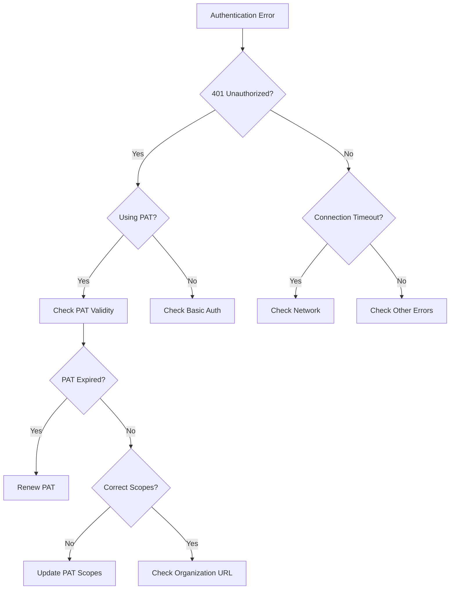

# Template Comparison Examples

This document provides side-by-side comparisons of different template types using examples from the Azure DevOps Node API. These examples will be used during our template review workshop with Jordan and Casey.

## API Reference Template vs. Class Template

### When to use API Reference Template
- Complex components with many methods (15+)
- Components with complex data structures
- Components requiring categorized methods

### When to use Class Template
- Simpler components with fewer methods
- Components with straightforward structure
- Components where all documentation fits in a single file

### Example: WorkItemTrackingApi (API Reference Template)

```markdown
# WorkItemTrackingApi

The WorkItemTrackingApi provides access to work items, queries, and other work item tracking functionality.

## Overview

The WorkItemTrackingApi is one of the most complex APIs in the Azure DevOps Node.js client. It allows you to:
- Create, update, and delete work items
- Execute and manage work item queries
- Manage work item types, fields, and classifications
- Handle work item attachments and comments

## Method Categories

### Work Item Methods
- [getWorkItem](#getworkitem)
- [getWorkItems](#getworkitems)
- [createWorkItem](#createworkitem)
- [updateWorkItem](#updateworkitem)
- [deleteWorkItem](#deleteworkitem)
- ...

### Query Methods
- [executeQuery](#executequery)
- [getQueries](#getqueries)
- [getQuery](#getquery)
- [createQuery](#createquery)
- ...

### Field Methods
- [getFields](#getfields)
- [getField](#getfield)
- [createField](#createfield)
- ...

## Method Details

### getWorkItem
...
```

### Example: TeamContext (Class Template)

```markdown
# TeamContext Class

The TeamContext class provides context information for team-related operations.

## Overview

The TeamContext class is used to specify the team context for operations that require team identification. It can be constructed with various combinations of team project, team, and project identifiers.

## Constructor

```typescript
constructor(
  projectId?: string,
  teamId?: string,
  project?: string,
  team?: string
)
```

### Parameters
- **projectId**: Optional string - The project ID
- **teamId**: Optional string - The team ID
- **project**: Optional string - The project name
- **team**: Optional string - The team name

## Properties

### projectId
```typescript
projectId?: string
```
The ID of the project.

### teamId
```typescript
teamId?: string
```
The ID of the team.

### project
```typescript
project?: string
```
The name of the project.

### team
```typescript
team?: string
```
The name of the team.

## Usage Examples

### Creating a TeamContext with project and team names
```typescript
const teamContext = new TeamContext(undefined, undefined, "MyProject", "MyTeam");
```

### Creating a TeamContext with project and team IDs
```typescript
const teamContext = new TeamContext("projectGuid", "teamGuid");
```
```

## API Method Template vs. Interface Template

### When to use API Method Template
- Documenting standalone methods
- Methods with complex parameters or return types
- Methods requiring detailed examples

### When to use Interface Template
- Documenting TypeScript interfaces
- Type definitions and contracts
- Interface extensions and implementations

### Example: getWorkItems (API Method Template)

```markdown
# getWorkItems

Retrieves work items for the specified IDs.

## Signature

```typescript
getWorkItems(
  ids: number[], 
  project?: string, 
  fields?: string[], 
  asOf?: Date, 
  expand?: WorkItemExpand
): Promise<WorkItem[]>
```

## Parameters

| Name | Type | Required | Description |
|------|------|----------|-------------|
| ids | number[] | Yes | The IDs of the work items to retrieve |
| project | string | No | Project ID or project name |
| fields | string[] | No | The fields to return in the work items |
| asOf | Date | No | Date to retrieve the work item as it existed at this point |
| expand | WorkItemExpand | No | The expand options for additional details |

## Return Value

Returns a Promise that resolves to an array of `WorkItem` objects.

## Examples

### Retrieving work items with default fields

```typescript
const workItemTrackingApi = await connection.getWorkItemTrackingApi();
const workItems = await workItemTrackingApi.getWorkItems([1, 2, 3]);
console.log(workItems);
```

### Retrieving work items with specific fields

```typescript
const workItemTrackingApi = await connection.getWorkItemTrackingApi();
const workItems = await workItemTrackingApi.getWorkItems(
  [1, 2, 3],
  "MyProject",
  ["System.Title", "System.State", "System.AssignedTo"]
);
console.log(workItems);
```

## Error Handling

The method may throw the following errors:
- `ArgumentError`: If the ids array is empty or contains invalid IDs
- `ProjectNotFoundError`: If the specified project doesn't exist
- `AuthorizationError`: If the user doesn't have permission to access the work items

## Related Methods

- [getWorkItem](./getWorkItem.md): Retrieve a single work item
- [createWorkItem](./createWorkItem.md): Create a new work item
- [updateWorkItem](./updateWorkItem.md): Update an existing work item
```

### Example: IWorkItemTrackingApi (Interface Template)

```markdown
# IWorkItemTrackingApi Interface

The interface that defines the work item tracking operations.

## Definition

```typescript
export interface IWorkItemTrackingApi {
    createWorkItem(
        customHeaders: any,
        document: VSSInterfaces.JsonPatchDocument,
        project: string,
        type: string,
        validateOnly?: boolean,
        bypassRules?: boolean
    ): Promise<WorkItemTrackingInterfaces.WorkItem>;
    
    getWorkItem(
        id: number,
        project?: string,
        fields?: string[],
        asOf?: Date,
        expand?: WorkItemTrackingInterfaces.WorkItemExpand
    ): Promise<WorkItemTrackingInterfaces.WorkItem>;
    
    getWorkItems(
        ids: number[],
        project?: string,
        fields?: string[],
        asOf?: Date,
        expand?: WorkItemTrackingInterfaces.WorkItemExpand
    ): Promise<WorkItemTrackingInterfaces.WorkItem[]>;
    
    // Additional methods...
}
```

## Methods

### createWorkItem
Creates a new work item.

### getWorkItem
Retrieves a single work item.

### getWorkItems
Retrieves multiple work items.

## Implementation

This interface is implemented by the `WorkItemTrackingApi` class.

## Usage

```typescript
import { IWorkItemTrackingApi } from 'azure-devops-node-api/WorkItemTrackingApi';

// Get the API implementation
const workItemTrackingApi: IWorkItemTrackingApi = await connection.getWorkItemTrackingApi();

// Use the interface methods
const workItems = await workItemTrackingApi.getWorkItems([1, 2, 3]);
```

## Extensions

This interface extends the base `IVssRestClientOptions` interface.
```

## Tutorial Template vs. Conceptual Guide Template

### When to use Tutorial Template
- Step-by-step instructions
- Task-oriented documentation
- Learning-focused content

### When to use Conceptual Guide Template
- Explaining complex concepts
- Architectural overviews
- Design principles and patterns

### Example: "Creating Work Items" (Tutorial Template)

```markdown
# Creating Work Items Tutorial

This tutorial guides you through the process of creating work items using the Azure DevOps Node.js API.

## Prerequisites

- Node.js installed (version 12 or higher)
- Azure DevOps account with appropriate permissions
- Personal Access Token (PAT) with Work Items (Read, Write) scope

## Step 1: Set up your project

Create a new Node.js project and install the required dependencies:

```bash
mkdir azure-devops-work-items
cd azure-devops-work-items
npm init -y
npm install azure-devops-node-api
```

## Step 2: Create a connection to Azure DevOps

Create a file named `index.js` with the following code:

```javascript
const azdev = require('azure-devops-node-api');

// Your organization URL and personal access token
const orgUrl = 'https://dev.azure.com/your-organization';
const token = 'your-personal-access-token';

// Create authorization handler
const authHandler = azdev.getPersonalAccessTokenHandler(token);

// Create connection
const connection = new azdev.WebApi(orgUrl, authHandler);

async function main() {
  try {
    // Test the connection
    const coreApi = await connection.getCoreApi();
    const projects = await coreApi.getProjects();
    console.log('Connected to Azure DevOps!');
    console.log(`Found ${projects.length} projects.`);
  } catch (error) {
    console.error('Error connecting to Azure DevOps:', error);
  }
}

main();
```

## Step 3: Get the Work Item Tracking API

Update your `main` function to get the Work Item Tracking API:

```javascript
async function main() {
  try {
    // Get the Work Item Tracking API
    const workItemTrackingApi = await connection.getWorkItemTrackingApi();
    console.log('Successfully connected to the Work Item Tracking API');
    
    // Continue with creating work items...
  } catch (error) {
    console.error('Error:', error);
  }
}
```

## Step 4: Create a work item

Add the following code to create a basic work item:

```javascript
// Define the project and work item type
const project = 'YourProjectName';
const workItemType = 'Task'; // Can be Bug, User Story, etc.

// Define the work item fields using JSON Patch format
const patchDocument = [
  {
    op: 'add',
    path: '/fields/System.Title',
    value: 'My first work item created via API'
  },
  {
    op: 'add',
    path: '/fields/System.Description',
    value: 'This is a description of my work item'
  },
  {
    op: 'add',
    path: '/fields/System.AssignedTo',
    value: 'your-email@example.com'
  }
];

// Create the work item
const workItem = await workItemTrackingApi.createWorkItem(
  null, // Custom headers (not needed for basic usage)
  patchDocument,
  project,
  workItemType
);

console.log('Work item created:', workItem.id);
console.log('Title:', workItem.fields['System.Title']);
```

## Step 5: Run your code

Run your code with Node.js:

```bash
node index.js
```

You should see output confirming that your work item was created.

## Next Steps

- Learn how to [update work items](./updating-work-items.md)
- Explore [work item queries](./querying-work-items.md)
- Implement [work item relationships](./work-item-relationships.md)

## Troubleshooting

### Common Errors

#### 401 Unauthorized
- Check that your personal access token is valid and has the correct scopes
- Verify that your organization URL is correct

#### 404 Project Not Found
- Verify that the project name is spelled correctly
- Check that you have access to the specified project

#### Field Validation Errors
- Ensure that required fields for your work item type are included
- Check that field values match the expected format
```

### Example: "Work Item Tracking Concepts" (Conceptual Guide Template)

```markdown
# Work Item Tracking Concepts

This guide explains the key concepts and architecture of the Azure DevOps work item tracking system.

## Introduction

Work items in Azure DevOps are the basic building blocks for tracking work. Understanding the underlying concepts and architecture helps you effectively use the Work Item Tracking API.

## Core Concepts

### Work Items

Work items represent units of work that need to be completed. Each work item:

- Has a unique ID within an organization
- Belongs to a specific work item type (Bug, Task, User Story, etc.)
- Contains fields that store information about the work
- Can be linked to other work items through relationships
- Has a revision history tracking all changes

### Work Item Types

Work item types define templates for different kinds of work. Each type:

- Has a specific schema defining required and optional fields
- Includes rules for field validation
- Has customizable workflows defining valid state transitions
- Can be customized at the process or project level


### Fields

Fields store information about work items. Key characteristics:

- Each field has a reference name (e.g., `System.Title`)
- Fields can be system-defined or custom
- Fields have specific data types (string, integer, datetime, etc.)
- Fields can have rules controlling their behavior

#### Common Field Categories

| Category | Examples | Purpose |
|----------|----------|---------|
| System | Title, ID, State | Core tracking information |
| Planning | Effort, Story Points | Estimation and planning |
| Classification | Area Path, Iteration Path | Categorization |
| Custom | Business Value, Risk | Organization-specific needs |

### Work Item Processes

Processes define collections of work item types and their behaviors:

- **Agile**: User Story, Task, Bug, Feature, Epic
- **Scrum**: Product Backlog Item, Task, Bug, Feature, Epic
- **CMMI**: Requirement, Task, Bug, Feature, Epic
- **Basic**: Issue, Task, Epic

## Architectural Overview

The Work Item Tracking system follows a layered architecture:

1. **Client Layer**: Node.js API client (what you're using)
2. **REST API Layer**: HTTP endpoints for work item operations
3. **Service Layer**: Business logic and validation
4. **Data Layer**: Storage and retrieval of work item data


## Advanced Concepts

### Work Item Tracking Process Model

The process model determines how work item types and their behaviors are defined:

- **Inherited Process Model**: Allows customization through the UI
- **Hosted XML Process Model**: Uses XML definitions for customization
- **On-premises XML Process Model**: Full XML customization for on-premises

### Field Rules

Rules control field behavior:

- **Required**: Field must have a value
- **Read-only**: Field cannot be modified
- **Conditional**: Field behavior depends on other fields
- **Default**: Field has a predefined value

### State Transitions

Work items follow defined workflows:

```
New → Active → Resolved → Closed
  ↑         ↓
  └─────────┘
```

State transitions can trigger actions like notifications or field updates.

## Best Practices

When working with the Work Item Tracking API:

1. **Batch operations** when possible to improve performance
2. **Cache work item type definitions** to reduce API calls
3. **Use field reference names** instead of display names
4. **Handle concurrency conflicts** using revision numbers
5. **Respect field rules** to avoid validation errors

## Related Concepts

- [Queries and WIQL](./wiql-concepts.md)
- [Work Item Classification](./classification-concepts.md)
- [Process Customization](./process-customization.md)

## Further Reading

- [Work Item Field Index](./work-item-field-index.md)
- [REST API Reference](https://docs.microsoft.com/rest/api/azure/devops/wit)
- [Process Templates](https://docs.microsoft.com/azure/devops/boards/work-items/guidance/choose-process)
```

## Troubleshooting Guide Template Example

### When to use Troubleshooting Guide Template
- Documenting common issues and solutions
- Creating diagnostic guidance
- Providing error resolution steps

### Example: "Authentication Issues" (Troubleshooting Guide Template)

```markdown
# Authentication Issues Troubleshooting Guide

This guide helps you diagnose and resolve common authentication issues when using the Azure DevOps Node.js API.

## Common Symptoms

- 401 Unauthorized responses
- "Authentication failed" errors
- "TF400813: Resource not available" errors
- Connection timeouts during authentication
- Personal access token (PAT) validation failures

## Diagnostic Process

Follow this decision tree to diagnose your authentication issue:



## Issue Categories

### Personal Access Token (PAT) Issues

#### Expired PAT
**Severity**: High  
**Resolution Time**: 5 minutes

**Symptoms**:
- 401 Unauthorized responses
- "TF400813: The user's access token has expired" error

**Diagnosis**:
1. Check the expiration date of your PAT in Azure DevOps
   - Go to User Settings > Personal Access Tokens
   - Verify the expiration date of the token you're using

**Solution**:
1. Create a new PAT:
   - Go to User Settings > Personal Access Tokens > New Token
   - Select the appropriate scopes (see below)
   - Set an appropriate expiration date
2. Update your application code with the new token

```javascript
// Replace your old token with the new one
const token = 'your-new-personal-access-token';
const authHandler = azdev.getPersonalAccessTokenHandler(token);
```

#### Insufficient PAT Scopes
**Severity**: Medium  
**Resolution Time**: 10 minutes

**Symptoms**:
- 403 Forbidden responses
- "TF400813: The user does not have permission to access this resource" error

**Diagnosis**:
1. Check the scopes of your PAT in Azure DevOps
   - Go to User Settings > Personal Access Tokens
   - Review the scopes assigned to your token

**Solution**:
1. Create a new PAT with the required scopes:
   - For full access: `vso.full_access`
   - For specific resources: Select the appropriate scopes (e.g., `vso.work`, `vso.code`)
2. Update your application code with the new token

**Required scopes for common operations**:

| Operation | Required Scope |
|-----------|---------------|
| Work Items | `vso.work` |
| Git Repositories | `vso.code` |
| Build Pipelines | `vso.build` |
| Release Pipelines | `vso.release` |

### Connection Configuration Issues

#### Incorrect Organization URL
**Severity**: Medium  
**Resolution Time**: 5 minutes

**Symptoms**:
- 404 Not Found responses
- "TF400813: Resource not available" errors

**Diagnosis**:
1. Verify the organization URL you're using
2. Ensure it follows the format: `https://dev.azure.com/{organization}`

**Solution**:
1. Update your code with the correct organization URL:

```javascript
// Correct format for organization URL
const orgUrl = 'https://dev.azure.com/your-organization';
const connection = new azdev.WebApi(orgUrl, authHandler);
```

#### Network Connectivity Issues
**Severity**: Medium  
**Resolution Time**: Varies

**Symptoms**:
- Connection timeouts
- ECONNREFUSED errors
- Network-related exceptions

**Diagnosis**:
1. Check if you can access Azure DevOps in a browser
2. Verify network connectivity and proxy settings
3. Check firewall rules that might block connections

**Solution**:
1. Configure proxy settings if needed:

```javascript
const proxy = 'http://your-proxy-server:port';
const options = {
  proxy,
  ignoreSslError: false
};
const connection = new azdev.WebApi(orgUrl, authHandler, options);
```

2. Ensure firewall rules allow connections to Azure DevOps domains

## Advanced Troubleshooting

### Debugging Authentication Flow

For persistent authentication issues, enable debug logging:

```javascript
const connection = new azdev.WebApi(orgUrl, authHandler, {
  allowRetries: true,
  maxRetries: 5,
  logLevel: 'debug'
});
```

### Common Error Codes

| Error Code | Description | Likely Cause |
|------------|-------------|--------------|
| TF400813 | Resource not available | Invalid URL or insufficient permissions |
| TF400898 | Authentication failed | Invalid credentials or expired token |
| TF401019 | The Git repository does not exist | Repository not found or no access |
| ECONNREFUSED | Connection refused | Network or proxy configuration issue |

## Prevention

To prevent authentication issues:

1. **Use environment variables** for tokens to avoid hardcoding
2. **Implement token rotation** before expiration
3. **Request minimal scopes** needed for your application
4. **Implement proper error handling** for authentication failures
5. **Use retry logic** for transient authentication issues

## Related Resources

- [Authentication Overview](./authentication-concepts.md)
- [Personal Access Tokens Guide](./personal-access-tokens.md)
- [OAuth Authentication](./oauth-authentication.md)
```

## Conclusion

These template examples demonstrate the different approaches to documentation based on content type and complexity. During our workshop, we'll review these examples and discuss how they can be applied to our specific documentation needs.

Key discussion points will include:
1. Template selection criteria
2. Customization options for specific use cases
3. Standardization of common elements across templates
4. Implementation strategy for the Azure DevOps Node API documentation 